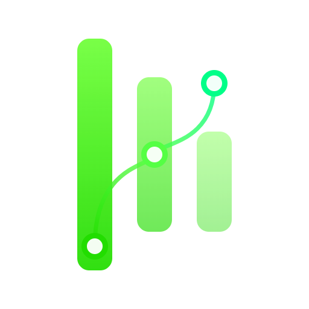
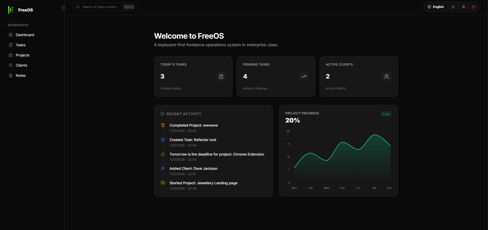
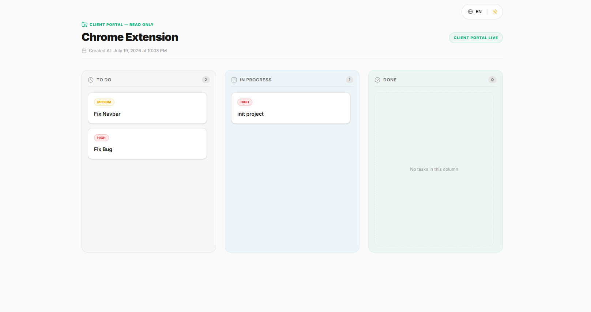
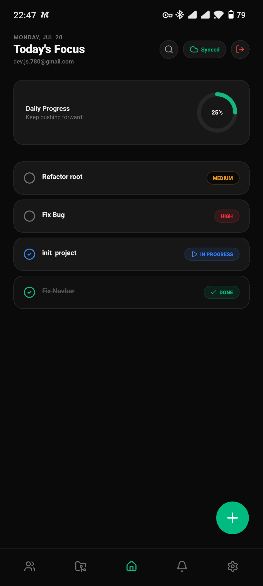
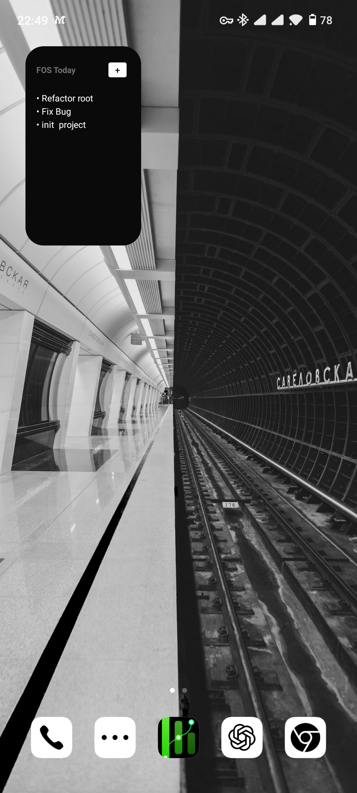

# FreeOS — The Freelancer Operations System 🚀

<div align="center">
  <p align="center">
    
  </p>
  <h3 align="center">FreeOS</h3>
  <p align="center">
    A production-grade, keyboard-first, and highly unified operations system designed specifically for modern freelancers.
  </p>
</div>

<p align="center">
  
  
  
  
  
  
</p>

🌐 **Live Web Application:** [https://freeos-web.vercel.app](https://freeos-web.vercel.app)
🤖 **Mobile Production APK:** [Direct Download Link](https://github.com/davariijs/freelanceros/releases/download/v1.0.0/freeos.apk)

---

## 🖼️ Application Showcase (Mockups)

<table width="100%">
  <tr>
    <td width="50%" align="center" valign="top">
      <b>💻 Web Admin Dashboard</b>
      <br/><br/>
      
    </td>
    <td width="50%" align="center" valign="top">
      <b>🔗 Secure Client Portal</b>
      <br/><br/>
      
    </td>
  </tr>

  <tr>
    <td width="50%" align="center" valign="top">
      <b>📱 Mobile Native App</b>
      <br/><br/>
      
      <p><i>(Replace with your Mobile Native App Screenshot)</i></p>
    </td>
    <td width="50%" align="center" valign="top">
      <b>🔋 Home Screen Widget</b>
      <br/><br/>
      
      <p><i>(Replace with your Android/iOS Native Widget Screenshot)</i></p>
    </td>
  </tr>
</table>

---

# 🛠️ Tech Stack & Workspace Architecture

FreeOS is built as a highly decoupled **Monorepo** managed with **pnpm Workspaces** and accelerated by **Turborepo**.

## Frontend (Web)

- Next.js 16 (App Router)
- Tailwind CSS v4
- Framer Motion
- Fuse.js (Fuzzy Search)

## Mobile

- React Native
- Expo SDK 56
- NativeWind v5
- Expo SecureStore
- Expo Push Notifications

## Backend

- Node.js
- Express
- TypeScript
- Prisma ORM v7

## Database

- Serverless PostgreSQL
- Neon Database

## CI/CD

- GitHub Actions
- Vercel Deployments
- Automated Vercel Cron Jobs

---

# 📂 Directory Structure

```text
freelanceros/
├── .github/
│   └── workflows/          # GitHub Actions CI/CD
├── apps/
│   ├── web/                # Next.js Application
│   ├── api/                # Express API
│   └── mobile/             # Expo Mobile App
├── packages/
│   ├── database/           # Prisma & PostgreSQL
│   ├── eslint-config/      # Shared ESLint
│   ├── prettier-config/    # Shared Prettier
│   └── ts-config/          # Shared TypeScript
```

---

# ⚡ Core Business Features & Capabilities

## 👥 1. Client Share Portal (B2B Roster)

Generate secure token-based links (`/shared/:token`) so clients can monitor project progress, completed tasks, and timelines without requesting manual updates.

---

## 🔔 2. Smart Multi-Channel Deadline Alerts

Exactly one day before project deadlines, FreeOS automatically sends:

- Web dashboard notifications
- Native mobile push notifications
- Email notifications via Nodemailer

---

## 📝 3. Connected Rich-Text Notes

Write Markdown notes and optionally attach them directly to a Task (`taskId`) so documentation always stays connected to execution.

---

## 🎨 4. Immersive 3D Landing Page

An interactive landing page built with:

- React Three Fiber
- Three.js
- Framer Motion

The virtual workspace smoothly animates according to scroll position.

---

## 🤖 5. Native Mobile Widgets & Biometrics

### Home Screen Widget

Native Android/iOS widgets display synchronized tasks in real time.

### Biometrics

Supports:

- Fingerprint Unlock
- Face ID
- Expo LocalAuthentication

---

## ⌨️ 6. Keyboard-First Workspace

### Command Palette (`Ctrl + K`)

Search across:

- Clients
- Projects
- Tasks
- Notes

Supports inline commands like:

```text
> task Fix login bug
```

which instantly creates a new task.

---

## 🌍 7. Dual Language & RTL Engine

Complete localization support for:

- 🇺🇸 English (LTR)
- 🇮🇷 Persian (RTL)

Available across:

- Web Dashboard
- Mobile Application
- Email Notifications

---

# 🚀 Quick Start (Local Development)

## 1. Installation

Install all workspace dependencies:

```bash
pnpm install
```

---

## 2. Database Sync

Configure your PostgreSQL connection inside `.env`, then execute:

```bash
pnpm --filter @freelanceos/database db:generate
pnpm --filter @freelanceos/database db:migrate
```

---

## 3. Running Services

Start workspace applications in development mode.

### Express Backend API

```bash
pnpm --filter @freelanceos/api dev
```

### Next.js Web Application

```bash
pnpm --filter @freelanceos/web dev
```

### Expo Mobile Development Server

```bash
pnpm --filter @freelanceos/mobile start -- --dev-client --clear
```

---

# 📦 Mobile Deployment (EAS Build)

## Development APK (Local)

```bash
cd apps/mobile && eas build --platform android --profile development --local --non-interactive
```

## Production APK (Expo Cloud)

```bash
cd apps/mobile && eas build --platform android --profile production-apk --non-interactive
```
